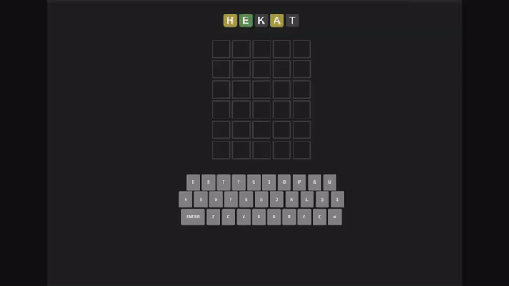
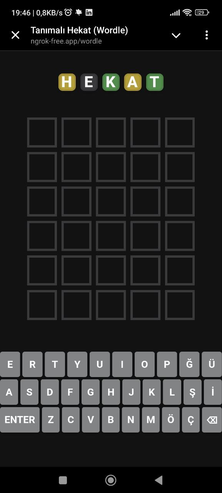
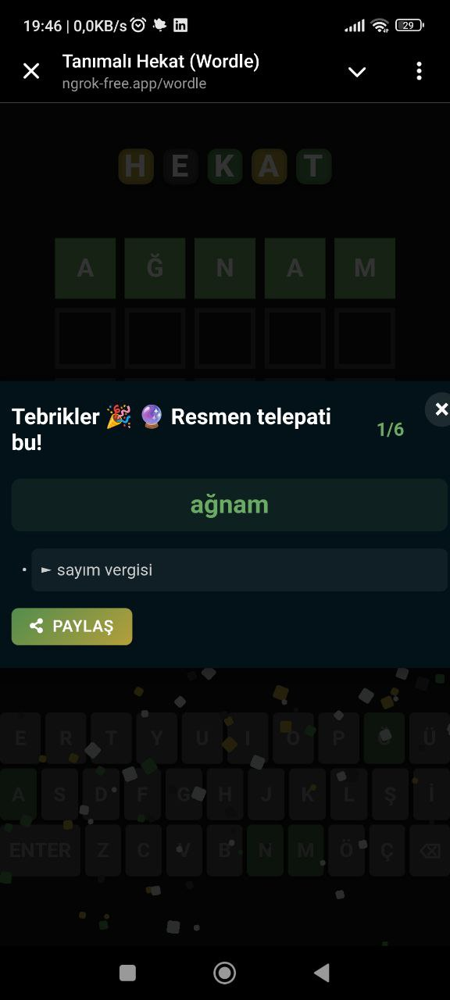

# Hekat (Wordle)

A Turkish implementation of the popular word game Wordle with word definitions from TDK (Turkish Language Association). Built with FastAPI backend and modern JavaScript frontend.

## Overview

Hekat is a Turkish word guessing game where players get 6 attempts to guess a 5-letter word. After each guess, the game provides feedback:

- 🟩 Green: Letter is correct and in the right position
- 🟨 Yellow: Letter exists in the word but in wrong position
- ⬛ Gray: Letter does not exist in the word

What makes this implementation special:
- Word definitions from TDK are shown after completing the game
- Mobile-friendly responsive design
- Local storage to save game progress
- Share results

## Features

- 🎲 Daily word challenges
- 📚 Turkish word validation using Bloom Filter
- 🔍 Word definitions from TDK
- 💾 Game state persistence
- 📱 Responsive design
- 🔄 Word of the day caching

## Technology Stack

### Backend
- FastAPI
- APScheduler (for daily word resets)
- SQLite
- Python 3.11+

### Frontend
- Vanilla JavaScript (ES6+)
- Modern CSS3
- HTML5
- Bloom Filter for word validation
- Local Storage for game state

### Special Features
- **Bloom Filter**: Efficient word validation with low memory footprint
- **WebAssembly Trie**: Fast prefix tree implementation for word lookups (in development)

## Installation

1. Clone the repository:
```bash
git clone https://github.com/emrekndl/tr-wordle-py.git
cd tr-wordle-py
```

2. Install uv (if not already installed [uv](https://docs.astral.sh/uv/)):
```bash
curl -LsSf https://astral.sh/uv/install.sh | sh
```

3. Install dependencies using uv:
```bash
uv sync
```

4. Create a virtual environment and activate it:
```bash
source .venv/bin/activate  # On Windows: .venv\Scripts\activate
```

5. Configure CORS settings:
Edit the CORS middleware settings in main.py:
```python
app.add_middleware(
    CORSMiddleware,
    allow_origins=["http://localhost:8000", "http://127.0.0.1:8000"],  # Allowed origins
    allow_credentials=True,
    allow_methods=["*"],
    allow_headers=["*"],
)
```

6. Run the application:
```bash
python main.py
```

The application will be available at `http://localhost:8000/wordle/`

Note: uv is a new, extremely fast Python package installer and resolver. It's written in Rust and designed to be a drop-in replacement for pip, providing much faster dependency resolution and installation.

## Project Structure

```
tr-wordle-py/
├── crud/               # Database CRUD operations 
├── data/              # Word lists and game data
├── db/                # Database models and configuration
├── ext/               # External tools (Bloom Filter, WebAssembly)
├── routers/           # FastAPI route handlers
├── tasks/            # Background tasks
├── utils/            # Utility functions
└── wordle-ui/        # Frontend application
    ├── css/          # Stylesheets
    ├── js/           # JavaScript modules
    └── img/          # Images and assets
```


### Demo
<div style="display: flex; justify-content: center;">
    
</div>

### Mobile View
<div style="display: flex; justify-content: center; gap: 20px;">
    
    
</div>

## Technical Details

### Bloom Filter Implementation

We use a Bloom Filter for efficient word validation with the following characteristics:
- Size: 81,708 bits
- Hash Functions: 10
- False Positive Rate: <1%

The Bloom Filter is implemented in both JavaScript (for client-side validation) and Go (for generating the filter data), providing quick word validation while maintaining a small memory footprint.

### Caching Strategy

The application uses multiple caching levels:
- Browser-side game state caching using LocalStorage
- Server-side word of the day caching using `@lru_cache`
- TDK word definition caching for improved performance

### Daily Word Selection
- Words are randomly selected from a curated list of 5-letter Turkish words
- The word of the day is synchronized for all users
- APScheduler ensures word rotation at midnight (Europe/Istanbul timezone)


## License

MIT License. See the [LICENSE](LICENSE) file for details.

