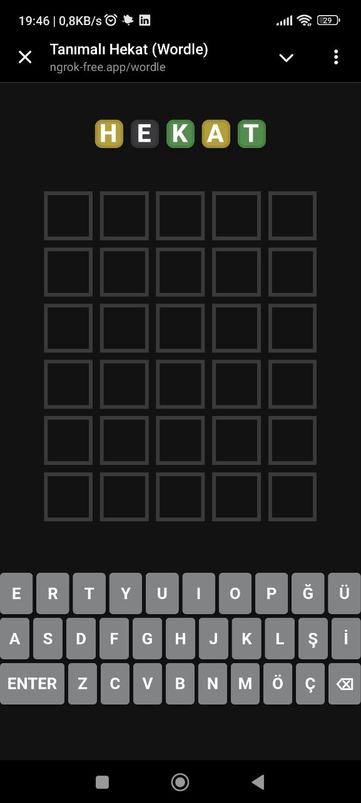
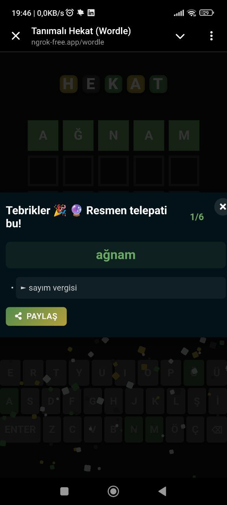

# Hekat (Wordle)

TDK (Türk Dil Kurumu) sözlük tanımlarıyla birlikte geliştirilen Türkçe Wordle oyunu. FastAPI backend ve modern JavaScript frontend ile oluşturulmuştur.
[Readme-EN](EN-README.md)

## Genel Bakış

Hekat, oyuncuların 5 harfli bir kelimeyi 6 denemede bulmaya çalıştığı bir Türkçe kelime tahmin oyunudur. Her tahminden sonra oyun şu şekilde geri bildirim verir:

- 🟩 Yeşil: Harf doğru ve doğru konumda
- 🟨 Sarı: Harf kelimede var ama yanlış konumda
- ⬛ Gri: Harf kelimede yok

Bu uygulamayı özel kılan özellikler:
- Oyun sonunda TDK'dan alınan kelime tanımları gösterilir
- Mobil cihazlara uyumlu tasarım
- Oyun ilerlemesini kaydetme özelliği
- Sonuçları paylaşabilme

## Özellikler

- 🎲 Günlük kelime görevi
- 📚 Bloom Filter kullanarak Türkçe kelime doğrulama
- 🔍 TDK kelime tanımları
- 💾 Oyun durumu kaydı
- 📱 Duyarlı tasarım
- 🔄 Günün kelimesi önbellekleme

## Teknoloji Altyapısı

### Backend
- FastAPI
- APScheduler (günlük kelime yenileme için)
- SQLite
- Python 3.11+

### Frontend
- Vanilla JavaScript (ES6+)
- Modern CSS3
- HTML5
- Bloom Filter kelime doğrulama
- Local Storage oyun durumu kaydı

### Özel Özellikler
- **Bloom Filter**: Düşük bellek kullanımı ile etkili kelime doğrulama
- **WebAssembly Trie**: Hızlı kelime arama için prefix ağacı uygulaması (geliştirme aşamasında)

## Kurulum

1. Depoyu klonlayın:
```bash
git clone https://github.com/emrekndl/tr-wordle-py.git
cd tr-wordle-py
```

2. uv paket yöneticisini yükleyin (kurulu değilse [uv](https://docs.astral.sh/uv/)):
```bash
curl -LsSf https://astral.sh/uv/install.sh | sh
```

3. Bağımlılıkları uv ile yükleyin:
```bash
uv sync
```

4. Sanal ortamı aktifleştirin:
```bash
source .venv/bin/activate  # Windows için: .venv\Scripts\activate
```

5. CORS ayarlarını yapılandırın:
main.py dosyasında CORS middleware ayarlarını düzenleyin:
```python
app.add_middleware(
    CORSMiddleware,
    allow_origins=["http://localhost:8000", "http://127.0.0.1:8000"],  # İzin verilen originler
    allow_credentials=True,
    allow_methods=["*"],
    allow_headers=["*"],
)
```

6. Uygulamayı çalıştırın:
```bash
python main.py
```

Uygulama `http://localhost:8000/wordle/` adresinde çalışmaya başlayacaktır.

Not: uv, pip'in yerine geçebilen, Rust ile yazılmış çok hızlı bir Python paket yükleyici ve çözümleyicisidir. Bağımlılık çözümleme ve kurulum işlemlerini çok daha hızlı gerçekleştirir.

## Proje Yapısı

```
tr-wordle-py/
├── crud/               # Veritabanı CRUD işlemleri
├── data/              # Kelime listeleri ve oyun verileri
├── db/                # Veritabanı modelleri ve yapılandırması
├── ext/               # Harici araçlar (Bloom Filter, WebAssembly)
├── routers/           # FastAPI yönlendiricileri
├── tasks/             # Arka plan görevleri
├── utils/             # Yardımcı fonksiyonlar
└── wordle-ui/         # Frontend uygulaması
    ├── css/           # Stil dosyaları
    ├── js/            # JavaScript modülleri
    └── img/           # Görseller
```


### Demo
<div style="display: flex; justify-content: center;">
    
</div>

### Mobil Görünüm
<div style="display: flex; justify-content: center; gap: 20px;">
    
    
</div>

## Teknik Detaylar

### Bloom Filter Uygulaması

Kelime doğrulama için aşağıdaki özelliklere sahip bir Bloom Filter kullanıyoruz:
- Boyut: 81,708 bit
- Hash Fonksiyonları: 10
- Yanlış Pozitif Oranı: <%1

Bloom Filter, hem JavaScript (istemci tarafı doğrulama) hem de Go (filtre verisi oluşturma) ile uygulanmıştır ve düşük bellek kullanımı ile hızlı kelime doğrulama sağlar.

### Önbellekleme Stratejisi

Uygulama birden fazla önbellekleme seviyesi kullanır:
- Local Storage ile tarayıcı tarafında oyun durumu önbellekleme
- `@lru_cache` ile sunucu tarafında günün kelimesi önbellekleme
- Performans için TDK kelime tanımları önbellekleme

### Günlük Kelime Seçimi
- Kelimeler, özel olarak seçilmiş 5 harfli Türkçe kelimeler listesinden rastgele seçilir
- Günün kelimesi tüm kullanıcılar için senkronize edilir
- APScheduler ile gece yarısında (Europe/Istanbul saat dilimi) kelime yenilenir


## Lisans

MIT Lisansı. Detaylar için [LICENSE](LICENSE) dosyasına bakınız.
